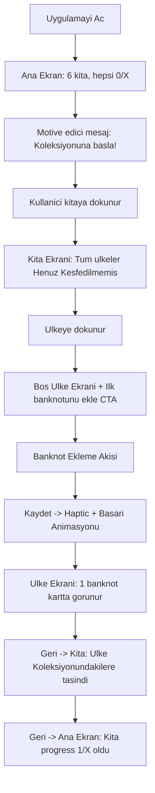
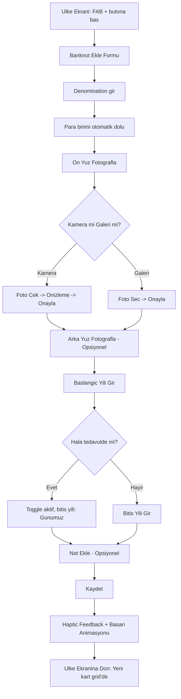
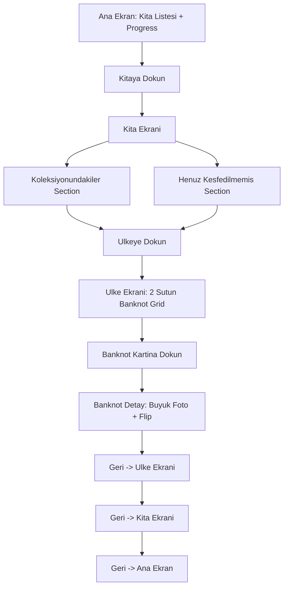
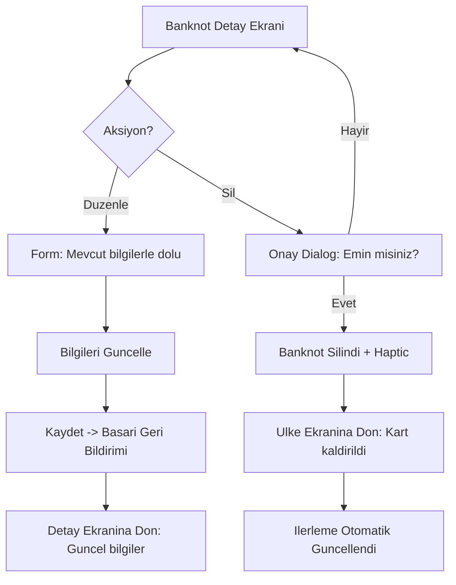

# UX Design Specification - Collectify Banknotes

**Author:** Alper
**Date:** 2026-02-07

---

## Executive Summary

### Project Vision
Banknot koleksiyoncularinin fotografladigi banknotlari ulke ve kita bazinda takip ettigi, ilerlemesini gorsel olarak hissettigi bir mobil uygulama. Soft, profesyonel, rehberleyici bir deneyim.

### Target Users
- **Casual collector:** Seyahat eden, ani biriktiren, basitlik isteyen
- **Serious collector:** Sistematik, detayci, denomination/year bilgisine onem veren
- Her iki grup da mobil-first, iOS/Android

### Key Design Challenges
1. Bos koleksiyon durumunda kullaniciyi motive etmek ve yonlendirmek
2. Dark tema ile okunakliligiddengelemek
3. ~195 ulke listesinde navigasyonu kolay tutmak

### Design Opportunities
1. Soft dark tema ile premium koleksiyon hissi yaratmak
2. Progress gorselleri ile "bir tane daha ekle" motivasyonu
3. Contextual empty states ile yeni kullaniciyi kaybetmemek

## Core User Experience

### Defining Experience

Collectify Banknotes'un temel deneyimi **"koleksiyonumda ne eksik?"** sorusuna aninda cevap vermektir. Kullanici uygulamayi actiginda hangi ulkelere ait banknotu oldugunu, hangilerine sahip olmadigini ve tedavul yillarini net sekilde gorebilmelidir. Bu, bir koleksiyoncunun en temel ihtiyacidir - envanter dogrulugu ve eksik parca farkindaligi.

### Platform Strategy

- **Birincil cihaz:** Telefon (iOS/Android)
- **Kullanim ortami:** Ev, masa ustu - kontrollü isik ve sabit ortam
- **Offline:** Temel islevler (koleksiyon goruntusu, ekleme) offline calisabilmeli
- **Fotograflama:** Masa ustu ortamda sabit cekim, iki yuz (on/arka) standart akis

### Effortless Interactions

1. **Fotograf cekimi & yukleme:** Tek tikla kamera ac, cek, otomatik kaydet. Minimum adim, maksimum hiz. Kullanici foto cekme/secme isleminde hicbir engele takilmamali.
2. **Ulke & para birimi otomasyonu:** Ulke secildiginde para birimi otomatik dolmali. Kullanici gereksiz veri girmemeli.
3. **Ilerleme hesaplamalari:** Her ekleme/silme aninda kita ve genel ilerleme aninda ve **dogru** guncellenmeli. Yanlis hesaplama kabul edilemez.

### Critical Success Moments

1. **"Tam bana gore" ani:** Kullanici banknotlarini kolayca takip edebildigini gordugu an - karmasik menuler veya karisik ekranlar yerine direkt, net bir koleksiyon gorunumu.
2. **Ilerleme hissi:** Bir kita icindeki tamamlanma yuzdesi arttiginda, ozellikle yeni bir ulke eklediginde gorsel geri bildirim.
3. **Kita tamamlama:** Bir kitadaki tum ulkelerden en az bir banknot toplamak - buyuk basari ani, kutlama hakeden milestone.
4. **Uygulama silme tetikleyicileri:** (a) Yanlis hesaplamalar/istatistikler, (b) Kotu, itici veya karisik UI. Bu ikisi kesinlikle olmamali.

### Experience Principles

1. **Dogruluk Oncelikli:** Hesaplamalar, tedavul yillari, ilerleme istatistikleri %100 dogru olmali. Kullanici veriye guvenmelidir.
2. **Gorsel Mukemmellik:** UI muhtesem olmali - soft dark tema, premium his, koleksiyon ruhu. Kotu UI = silinen uygulama.
3. **Surtunesiz Ekleme:** Banknot ekleme akisi minimum adim, maksimum otomasyon. Foto cek -> bilgileri gir -> kaydet, hicbir engel yok.
4. **Ilerleme Motivasyonu:** Her eklemede gorsel ilerleme geri bildirimi. Kita tamamlama kutlamasi. "Bir tane daha ekle" motivasyonu.
5. **Eksik Odakli Tasarim:** Koleksiyonda ne VAR'dan ziyade ne EKSIK one cikmali - koleksiyoncuyu motive eden sey hedefin ne kadar yakin oldugunu gormektir.

## Desired Emotional Response

### Primary Emotional Goals

- **Gurur & Basari:** Kullanici koleksiyonuna her baktiginda "bunu ben olustturdum" gururu hissetmeli. Ilerleme gorselleri, tamamlanan kitalar, toplam banknot sayisi bu gururu beslemeli.
- **Tatmin:** Her banknot eklendiginde aninda tatmin hissi - islem tamamlandi, koleksiyon buyudu, ilerleme artti. Kucuk ama surekli dopamin.
- **Nostalji:** Koleksiyonu gezerken banknotlarin fotograflari, ulke isimleri ve tedavul yillari seyahat anilarina, hikayelere baglanmali. Uygulama bir koleksiyon albumu hissi vermeli.

### Emotional Journey Mapping

| Asama | Hedef Duygu | Tasarim Yaklasimi |
|-------|-------------|-------------------|
| **Ilk acilis (bos koleksiyon)** | Merak & motivasyon | Davetkar empty state, "Ilk banknotunu ekle" yonlendirmesi, ne kadar kesfedilecek ulke oldugunu gosterme |
| **Banknot eklerken** | Tatmin & kolaylik | Hizli akis, basarili kayit sonrasi gorsel onay, ilerleme animasyonu |
| **Koleksiyonu gezerken** | Gurur & nostalji | Buyuk fotograf gorselleri, ulke bayraklari, premium kart tasarimi |
| **Ilerleme goruntuleme** | Basari & motivasyon | Kita bazli progress bar, tamamlanan ulke sayilari, kutlama animasyonlari |
| **Hata durumlarinda** | Guven & sabir | Yumusak hata mesajlari, net cozum yolu, asla kullaniciyi suclamayan dil |
| **Tekrar actiginda** | Tanidiklik & sureklilik | Son kaldigi yeri hatirlatan arayuz, degisen istatistikler |

### Micro-Emotions

- **Guven > Suphe:** Hesaplamalar her zaman dogru, veri kaybolmaz, uygulama sozu tutar
- **Basari > Hayal Kirikligi:** Her islem basarili sonuclanir, hatalar nazikce yonetilir
- **Netlik > Karisiklik:** Her ekran tek amaca hizmet eder, kullanici asla "simdi ne yapacagim?" demez
- **Heyecan > Sikinti:** Yeni ulke kesfetmek, ilerleme gormek hep heyecan yaratir

### Design Implications

1. **Gurur icin:** Premium gorsel tasarim, koleksiyonu vitrin gibi sunma, buyuk ve net fotograflar, altin vurgular
2. **Tatmin icin:** Basarili islem sonrasi micro-animasyonlar (checkmark, progress artisi), haptic feedback
3. **Nostalji icin:** Sicak renk paleti, banknot fotograflarini on plana cikarma, album hissi veren kart tasarimi
4. **Karisikliktan kacinma icin:** Minimal ekranlar, tek amacli sayfalar, net hiyerarsi, acik etiketler
5. **Basarisizlik hissinden kacinma icin:** Hatalar yumusak dille ifade edilir ("Tekrar deneyelim"), bos durumlar motive edici mesajlarla donatilir, asla "0 banknot" yerine "Henuz eklenmemis - kesfet!"

### Emotional Design Principles

1. **Her Etkilesim Bir Odul:** Banknot ekleme, koleksiyon gezme, ilerleme gorme - her aksiyonun sonunda kullanici kendini iyi hissetmeli.
2. **Basarisizlik Yok, Firsatlar Var:** Bos ulkeler "eksik" degil "kesfedilecek", hatalar "sorun" degil "tekrar deneyelim".
3. **Koleksiyon Gururu:** Arayuz, koleksiyonu bir muzedeki vitrin gibi sunmali - kullanicinin emegine saygi.
4. **Yumusak Rehberlik:** Kullanici asla kaybolmamali. Her ekranda ne yapilacagi belli, ama zorla degil, nazikce.

## UX Pattern Analysis & Inspiration

### Inspiring Products Analysis

**Duolingo**
- **Ilerleme sistemi ustasi:** Her dersten sonra XP, streak sayaci, seviye atlama - kullanici surekli "bir adim daha" motivasyonu hisseder
- **Kutlama animasyonlari:** Confetti, yildizlar, sesli geri bildirim - kucuk basarilar bile buyuk hissettirilir
- **Basit navigasyon:** Ana ekranda tek bir yol (ders sirasi), kullanici asla "nereye gidecegim?" demez
- **Bos durum yonetimi:** Yeni kullanici ilk saniyeden itibaren ne yapacagini bilir, davetkar ve rehberleyici
- **Progress bar her yerde:** Ders icinde, gun icinde, haftalik - ilerleme surekli gorunur

**Apple Wallet**
- **Kart bazli gorsel tasarim:** Her kart bir fiziksel nesneyi temsil eder - gercekci, dokunulabilir his
- **Minimal chrome:** Gereksiz buton, menu, tab yok - sadece kartlar ve detay
- **Tap-to-reveal:** Karta dokun, detaylari gor - basit ve sezgisel
- **Duzgun hiyerarsi:** Kartlar ustten alta dizilir, onemli olan ustte, temiz organizasyon
- **Premium estetik:** Karanlik arka plan uzerinde parlak kartlar - koleksiyon vitrin hissi

### Transferable UX Patterns

**Duolingo'dan Alinacaklar:**
| Pattern | Collectify'daki Kullanim |
|---------|-------------------------|
| Progress bar & ilerleme gorseli | Kita bazli tamamlanma yuzdeleri, ana ekranda genel ilerleme |
| Kutlama animasyonlari | Yeni banknot eklendiginde, yeni ulke acildiginda, kita tamamlandiginda |
| Tek yonlu basit navigasyon | Ana ekran -> Kita -> Ulke -> Banknot, geri tusla donus, karisiklik yok |
| Motive edici bos durumlar | "Henuz Avrupa'da 0/44 ulke kesfettin - ilk banknotunu ekle!" |
| Streak/sayi gururlandirma | Toplam banknot sayisi, toplam ulke sayisi gururla gosterilir |

**Apple Wallet'tan Alinacaklar:**
| Pattern | Collectify'daki Kullanim |
|---------|-------------------------|
| Kart bazli gorsel sunum | Banknot kartlari: fotograf on planda, denomination ve yil uzerinde |
| Minimal, temiz arayuz | Her ekranda sadece gerekli olan, fazla buton/menu yok |
| Dark bg + parlak kartlar | Soft dark arka plan, banknot kartlari hafif acik yuzeyde one cikar |
| Tap-to-reveal detay | Banknot kartina dokun -> tam ekran fotograf ve detaylar |
| Premium, vitrin estetigi | Koleksiyon bir muze vitrininde gibi sunulur |

### Anti-Patterns to Avoid

1. **Karisik menuler:** Tab bar + hamburger menu + drawer + modal = kabus. Collectify tek navigasyon yolu kullanacak (stack navigation)
2. **Gereksiz adimlar:** "Emin misiniz?" onaylari, gereksiz ara ekranlar, zorla tutorial. Kullanici foto ceksin, bilgi girsin, kaydetsin - bitti.
3. **Asiri bildirim/gamification:** Duolingo'nun streak baskisi ve push notification agresifligi kopyalanMAMALI. Motivasyon nazik olmali, baski degil.
4. **Bilgi kirliligi:** Her ekranda her seyi gostermeye calismak. Bir ekran = bir amac.
5. **Gizli aksiyonlar:** Onemli butonlari swipe gesture'larin arkasina saklamak. Ana aksiyonlar her zaman gorunur olmali.

### Design Inspiration Strategy

**Benimsenecek:**
- Duolingo'nun ilerleme gorsellestirmesi ve kutlama anlari
- Apple Wallet'in kart bazli premium estetigi ve minimal yaklasimi
- Her ikisinin de "karmasikliksiz derinlik" felsefesi

**Uyarlanacak:**
- Duolingo'nun gamification'i -> agresif degil, nazik ilerleme motivasyonu (baski yok, gurur var)
- Apple Wallet'in statik kart gorunumu -> interaktif koleksiyon kartlari (fotograf, yil, detay)

**Kacinilacak:**
- Duolingo'nun push notification agresifligi ve streak baskisi
- Fazla animasyon/efekt ile performans kaybi
- Karmasik navigasyon yapilari (tab + drawer + modal)

## Design System Foundation

### Design System Choice

**Custom Design System - NativeWind v4 (TailwindCSS) uzerine**

Collectify Banknotes, tamamen ozel tasarlanmis bir design system kullanacak. NativeWind v4 utility class'lari temel yapi tasi olacak, tum bilesenler sifirdan projede olusturulacak.

### Rationale for Selection

1. **Premium estetik kontrolu:** Soft dark tema, altin vurgular, koleksiyon vitrin hissi - hazir kitlerde bu kombinasyon yok
2. **Sifir ek bagimlilik:** NativeWind zaten entegre, ek UI kit kurulumu ve versiyon uyumu derdi yok
3. **Ilham kaynaklarina uyum:** Apple Wallet'in kart estetigi ve Duolingo'nun ilerleme gorselleri tamamen ozel bilesenler gerektirir
4. **Tek gelistirici avantaji:** Kutuphane ogrenme egrisi yerine, direkt ihtiyaca ozel bilesenler uretmek daha verimli
5. **Tutarlilik:** Tum bilesenler ayni tasarim tokenlariyla (colors, spacing, radius) olusturulacak, parca parca degil butunsel bir dil

### Implementation Approach

- **Tailwind config** uzerinden design token'lar tanimlanacak (renkler, spacing, border-radius, font sizes)
- **Atomic bilesenler:** GoldButton, Badge, Header, EmptyState, Card gibi tekrar kullanilabilir kucuk parcalar
- **Composed bilesenler:** BanknoteCard, CountryListItem, PhotoCapture gibi is mantigi iceren parcalar
- **Ekran bazli layout:** Her ekran kendi layout mantigiyla, ortak Header bileseni ile tutarlilik

### Customization Strategy

- **Design Tokens (tailwind.config.js):**
  - Soft dark renk paleti (arka plan, yuzey, vurgu, metin katmanlari)
  - Altin/amber accent renkleri (primary accent)
  - Tutarli spacing scale (4, 8, 12, 16, 20, 24, 32)
  - Border radius scale (sm: 8, md: 12, lg: 16, xl: 24)
  - Font size hiyerarsisi (xs, sm, base, lg, xl, 2xl)
- **Bilesen Kutuphanesi:**
  - Her bilesen NativeWind className ile stillendirilecek
  - Tema degisikligi tek noktadan (tailwind config) yapilabilecek
  - Reanimated animasyonlar bilesen icinde kapsullenecek

## 2. Core User Experience

### 2.1 Defining Experience

**"Banknotunu fotografla, koleksiyonunu tek bakista gor, eksiklerini kesfet."**

Collectify Banknotes'un tanimlayici deneyimi uc katmanli:
1. **Hizli ekleme:** Ulke sec -> foto cek -> kaydet. 3-4 saniye icinde "tamam, eklendi" hissi.
2. **Tek bakis koleksiyon:** Ana ekrandan tum koleksiyonu kita bazli gormek - neyin var, neyin eksik, aninda.
3. **"Bende var mi?" sorusuna aninda cevap:** Bir banknotu eline aldiginda uygulamayi ac, ulkeye bak, cevabi gor.

### 2.2 User Mental Model

**Mevcut cozum:** Fiziksel dosyalama - banknotlar dosyalarda, ulkelere gore ayrilmis. Bu sistem calisir ama:
- Tek bakista genel tablo gorulmez
- "Hangi ulkeler eksik?" sorusuna cevap vermez
- Ilerleme takibi yok
- Tasima ve erisim zor

**Zihinsel model:** Kullanici bir banknotu eline aldiginda ilk sorusu **"Bende bundan var mi?"** - bu, uygulamanin en hizli cevaplayacagi soru olmali. Ulke -> banknot listesi -> var/yok, saniyeler icinde.

**Beklenti:** Fiziksel dosyalamanin dijital, zenginlestirilmis, gorsel versiyonu. Dosyalama aliskanligi korunacak (ulke bazli organizasyon) ama ustune ilerleme takibi, fotograf arsivi ve eksik kesfetme eklenecek.

### 2.3 Success Criteria

| Kriter | Hedef |
|--------|-------|
| **Koleksiyonu tek bakista gorme** | Ana ekranda kita bazli ilerleme, 1 saniyede genel tablo |
| **Banknot ekleme suresi** | Ulke sec -> foto cek -> kaydet: **3-4 saniye hissi** (gercek sure 10-15sn olabilir ama akis surtunesiz hissetmeli) |
| **"Bende var mi?" cevabi** | Ulkeye git, banknot listesini gor: **2 saniye** |
| **Hesaplama dogrulugu** | Ilerleme yuzdeleri, ulke sayilari **%100 dogru** - sifir hata toleransi |
| **Gorsel tatmin** | Koleksiyon vitrin hissi, premium karanlik tema, banknot fotograflari on planda |

### 2.4 Novel UX Patterns

**Yaklasim: Bilinen pattern'lari ozel kombinasyonla kullanma**

Collectify tamamen yeni bir etkilesim icat etmiyor - bilinen pattern'lari koleksiyon baglamine uyarliyor:

- **Bilinen:** Liste navigasyonu (Kita -> Ulke -> Banknot) - herkes bilir
- **Bilinen:** Kart bazli gorsel sunum (Apple Wallet) - sezgisel
- **Bilinen:** Progress bar ilerleme takibi (Duolingo) - motive edici
- **Ozel kombinasyon:** Bu uc pattern'in "banknot koleksiyonu" icin birlesimi benzersiz

**Egitim ihtiyaci:** Sifir. Kullanici uygulamayi actiginda ne yapacagini bilmeli. Onboarding ekrani yerine contextual rehberlik (empty state mesajlari, ilk ekleme yonlendirmesi).

### 2.5 Experience Mechanics

**Temel Akis: Banknot Ekleme**

```
1. BASLATMA
   Kullanici ulke ekraninda "+" butonuna basar
   VEYA bos ulke ekraninda "Ilk banknotunu ekle" CTA'sina basar

2. ULKE SECIMI (otomatik - zaten ulke ekranindaysa)
   Para birimi otomatik dolar
   Kullanici denomination (kupur) yazar

3. FOTOGRAFLAMA
   "On yuz fotografla" -> Kamera acilir -> Cek -> Onizleme -> Onayla
   "Arka yuz fotografla" (opsiyonel) -> Ayni akis

4. DETAYLAR
   Tedavul baslangic yili (zorunlu)
   Bitis yili veya "Hala tedavulde" toggle
   Notlar (opsiyonel)

5. TAMAMLAMA
   "Kaydet" -> Haptic feedback + basari animasyonu
   Ilerleme guncellenir (ulke sayaci, kita yuzdesi)
   Kullanici ulke ekranina doner, yeni banknot kartta gorunur
```

**Temel Akis: Koleksiyon Gezme**

```
1. ANA EKRAN
   Kita listesi + ilerleme yuzdesi + ulke sayilari
   Tek bakista "neredeyim?" cevabi

2. KITA EKRANI
   "Koleksiyonundakiler" (ulke + banknot sayisi)
   "Henuz kesfedilmemis" (eksik ulkeler - motive edici)

3. ULKE EKRANI
   Banknot kartlari grid (fotograf + denomination + yil)
   "+" butonu ile hizli ekleme

4. BANKNOT DETAY
   Tam ekran fotograf (on/arka flip)
   Tum bilgiler + duzenleme/silme
```

## Visual Design Foundation

### Color System

**Soft Dark Tema - "Muze Vitrini" Paleti**

| Token | Hex | Kullanim |
|-------|-----|----------|
| `background` | `#14161E` | Ana arka plan - koyu lacivert/antrasit, sicak karanlik |
| `surface` | `#1E2030` | Kart, liste, yuzey alanlari - bir ton acik |
| `surface-light` | `#282A3A` | Hover/aktif durumlar, ayirici cizgiler |
| `accent` | `#D4A843` | Altin - butonlar, progress bar, onemli vurgular |
| `accent-dark` | `#B8922F` | Altin pressed/aktif durum |
| `accent-glow` | `#D4A84320` | Altin %12 opacity - subtle glow efektleri |
| `text-primary` | `#F0EBE3` | Ana metin - sicak beyaz, kagit tonu |
| `text-secondary` | `#8B8D9E` | Ikincil metin, aciklamalar |
| `text-muted` | `#555770` | Placeholder, deaktif metin |
| `success` | `#4CAF82` | Basarili islem, tamamlanan oge |
| `danger` | `#E85D5D` | Silme, hata |
| `border` | `#2A2C3E` | Ince ayirici cizgiler |

**Kontrast Kurallari:**
- `text-primary` / `background` -> 12.5:1 (AAA)
- `text-secondary` / `background` -> 4.8:1 (AA)
- `accent` / `background` -> 7.2:1 (AAA)
- Tum onemli metin en az AA (4.5:1) kontrast saglamali

### Typography System

**Yaklasim: Ince, Elegant, Rakam Odakli**

| Seviye | Boyut | Agirlik | Kullanim |
|--------|-------|---------|----------|
| `display` | 32px | Light (300) | Ana ekran basligi "COLLECTIFY" |
| `h1` | 24px | Light (300) | Ekran basliklari (kita adi, ulke adi) |
| `h2` | 20px | Regular (400) | Section basliklari |
| `h3` | 16px | Medium (500) | Kart basliklari, ulke isimleri |
| `body` | 14px | Regular (400) | Aciklama metinleri (nadir kullanilir) |
| `caption` | 12px | Regular (400) | Etiketler, tarihler |
| `number-lg` | 28px | Light (300) | Buyuk rakamlar (ilerleme yuzdesi, toplam) |
| `number-md` | 18px | Regular (400) | Orta rakamlar (banknot sayisi, denomination) |
| `number-sm` | 14px | Regular (400) | Kucuk rakamlar (yillar, detaylar) |

**Font:** System font (San Francisco iOS / Roboto Android) - ince agirliklar her iki platformda da elegant gorunur, ek font yukleme gerektirmez.

**Prensip:** Basliklar ince ve buyuk, rakamlar net ve vurgulu, govde metni minimumda. Uygulama "okunan" degil "bakilan" bir deneyim.

### Spacing & Layout Foundation

**Yaklasim: Ferah, Bosluklu, Apple Tarzi**

**Spacing Scale (8px bazli):**

| Token | Deger | Kullanim |
|-------|-------|----------|
| `xs` | 4px | Ikon-metin arasi, badge padding |
| `sm` | 8px | Compact ic bosluk |
| `md` | 16px | Standart ic bosluk, liste ogeleri arasi |
| `lg` | 24px | Section arasi bosluk |
| `xl` | 32px | Ekran padding, buyuk ayiricilar |
| `2xl` | 48px | Ekranlar arasi buyuk bosluk |

**Layout Prensipleri:**
1. **Nefes alan tasarim:** Ogeler arasinda minimum 16px bosluk, section'lar arasi 24-32px
2. **Yatay padding:** Ekranin iki yaninda 20px sabit padding
3. **Kart ic boslugu:** 16px her yonden, iceri rahatlik
4. **Liste ogeleri:** 12-16px dikey aralik, sikisik degil
5. **Touch target:** Minimum 44x44pt - parmak rahatca dokunabilmeli

**Border Radius:**

| Token | Deger | Kullanim |
|-------|-------|----------|
| `sm` | 8px | Kucuk butonlar, badge |
| `md` | 12px | Input alanlari, kucuk kartlar |
| `lg` | 16px | Ana kartlar, banknot kartlari |
| `xl` | 24px | Buyuk modal, bottom sheet |
| `full` | 9999px | Yuvarlak butonlar, FAB |

### Accessibility Considerations

- **Kontrast:** Tum metin-arka plan kombinasyonlari WCAG AA (4.5:1) ustunde
- **Touch target:** Minimum 44x44pt tum interaktif ogeler
- **Font boyutu:** En kucuk metin 12px, onemli bilgi en az 14px
- **Renk korlugu:** Altin accent + yesil success + kirmizi danger - renk korlugu icin ikon/sekil destegi
- **Animasyonlar:** Reduce Motion ayarina saygi, animasyonlar kapatilabilir
- **Kontrast modu:** Gerekirse text-primary tam beyaz (#FFFFFF) yapilabilir

## Design Direction Decision

### Design Directions Explored

Uc farkli tasarim yonu degerlendirildi:

- **A - Museum Gallery:** Buyuk kartlar, bol bosluk, vitrin hissi, tek sutun banknot kartlari
- **B - Collector's Dashboard:** Kompakt grid, daha fazla bilgi tek bakista, 2 sutun banknot kartlari
- **C - Wallet Stack:** Ust uste yigilmis kartlar, derinlik hissi, gesture-based navigasyon

### Chosen Direction

**Direction A (Museum Gallery) + B'den 2 sutun banknot grid'i**

Secilen yaklasim, Museum Gallery'nin ferah ve elegant ana yapisini korurken, banknot kartlarini 2 sutun grid ile daha verimli sunuyor.

**Ana Ekran (A'dan):**
- Kita kartlari dikey liste, buyuk ve ferah
- Her kita kartinda: emoji/ikon + kita adi (Light 300) + progress bar (altin) + "12/44 ulke" rakam
- Kartlar arasi 16px bosluk, her kart `surface` rengi, `lg` radius

**Kita Ekrani (A'dan):**
- "Koleksiyonundakiler" / "Henuz Kesfedilmemis" section'lari
- Ulke listesi tek sutun, bayrak + isim + banknot sayisi badge
- Ferah liste ogeleri, 12px aralik

**Ulke Ekrani (A+B kombinasyonu):**
- Baslik: bayrak + ulke adi (Light 300, buyuk)
- Banknot kartlari: **2 sutun grid** (B'den)
- Her kart: fotograf ust yarisi kaplar, altinda denomination + yil
- Kartlar arasi 12px gap, kart ici 12px padding
- Floating "+" FAB butonu (altin, sag alt)

**Banknot Detay (A'dan):**
- Buyuk fotograf (ekranin %60'i), on/arka flip animasyonu
- Altinda: denomination (number-lg), yil araligi, para birimi
- Duzenle + Sil aksiyonlari
- Ferah, nefes alan layout

### Design Rationale

1. **Museum Gallery temeli:** Ferah bosluk, ince tipografi, premium his - kullanicinin "koleksiyon gururu" duygusal hedefine uygun
2. **2 sutun banknot grid'i:** Bir ulkede birden fazla banknot oldugunda tek sutun cok yer kaplar. 2 sutun ile kullanici tek bakista daha fazla banknot gorur - "bende ne var?" sorusuna hizli cevap
3. **Kita kartlari tek sutun:** Ana ekranda sadece 6 kita var, buyuk kartlar daha etkileyici ve progress bilgisi daha okunakli
4. **Apple Wallet ilhami:** Dark bg uzerinde acik surface kartlar, derinlik hissi, minimal chrome
5. **Duolingo ilhami:** Progress bar her kita kartinda, motive edici rakamlar on planda

### Implementation Approach

**Ekran Bazli Layout Kurallari:**

| Ekran | Layout | Kart Boyutu | Bosluk |
|-------|--------|-------------|--------|
| Ana Ekran | Tek sutun ScrollView | Full width - 40px (padding) | 16px gap |
| Kita Ekrani | SectionList, tek sutun | Full width - 40px | 12px gap |
| Ulke Ekrani | FlatList, **2 sutun grid** | (width - 52px) / 2 | 12px gap |
| Banknot Detay | ScrollView, tek sutun | Full width | 16px sections |
| Banknot Ekle | ScrollView, form | Full width - 40px | 16px fields |

**Kart Tasarim Spesifikasyonu:**

- **Kita Karti:** `surface` bg, `lg` radius, 16px padding, progress bar + rakamlar
- **Ulke Satiri:** `surface` bg, `md` radius, 12px padding, bayrak + isim + badge
- **Banknot Karti (2 sutun):** `surface` bg, `lg` radius, fotograf ust %65 + bilgi alt %35, 0 padding (fotograf kenardan kenara), bilgi alani 12px padding
- **FAB Butonu:** `accent` bg, `full` radius, 56x56pt, sag alt 20px offset, golge

## User Journey Flows

### Journey 1: Ilk Kullanim (First Time User)



**Kritik Tasarim Kararlari:**
- Bos ana ekran korkutucu degil, davetkar olmali - "6 kita seni bekliyor" hissi
- Ilk banknot eklendikten sonra aninda gorsel geri bildirim (progress degisimi)
- Kullanici 3 adimda (kita -> ulke -> ekle) ilk basarisina ulasmali

### Journey 2: Banknot Ekleme (Core Loop)



**Kritik Tasarim Kararlari:**
- Akis B sirasi: Ulke zaten secili -> form acilir -> foto cek -> bilgi gir -> kaydet
- Para birimi otomatik - kullanici yazmaz
- "Hala tedavulde" toggle ile bitis yili kolayligi
- 3-4 saniye hissi: akis surtunesiz, bekleme yok

### Journey 3: Koleksiyon Gezme



**Kritik Tasarim Kararlari:**
- Her seviyede geri tusu ile tek adimda donus
- Kita ekraninda "Koleksiyonundakiler" ust tarafta - gurur hissi
- "Henuz Kesfedilmemis" alt tarafta - motivasyon
- Stack navigation: her zaman nerede oldugunu bil

### Journey 4: Banknot Duzenleme/Silme



**Kritik Tasarim Kararlari:**
- Silme icin onay dialog zorunlu - geri dondurulemez islem
- Duzenleme formu mevcut bilgilerle onceden dolu
- Silme sonrasi ilerleme aninda guncellenir (kita yuzdesi, ulke sayisi)

### Journey Patterns

**Navigasyon Paterni:** Stack-based, her zaman ileri-geri. Kita -> Ulke -> Banknot -> Detay. Kullanici asla kaybolmaz.

**Geri Bildirim Paterni:** Her basarili islemde (ekle/duzenle/sil) haptic feedback + gorsel animasyon. Kullanici aksiyonunun sonucunu aninda gorur.

**Progress Paterni:** Her degisiklik (ekleme/silme) aninda ilerleme rakamlarini gunceller. Ana ekrana donuldugunde guncel progress gorunur.

**Empty State Paterni:** Bos durumlar her zaman motive edici CTA icerir. "0 banknot" yerine "Ilk banknotunu ekle!" - aksiyon odakli, cesaretlendirici.

### Flow Optimization Principles

1. **Minimum adim:** Her yolculuk mumkun olan en az adimla tamamlanmali
2. **Otomatik doldurma:** Bilinebilen bilgiler (para birimi, ulke) otomatik gelmeli
3. **Aninda geri bildirim:** Her aksiyonun sonucu 1 saniye icinde gorunmeli
4. **Geri donus kolayligi:** Her noktadan bir onceki ekrana tek tikla donus
5. **Hata onleme:** Silme gibi kritik islemlerde onay, ama gereksiz "emin misiniz?" yok

## Component Strategy

### Design System Components

**Temel Yaklasim:** Tum bilesenler NativeWind v4 utility class'lari ile sifirdan olusturulacak. Harici UI kit kullanilmayacak. Design token'lar `tailwind.config.js` uzerinden yonetilecek.

**Token Katmani (tailwind.config.js):**
- Colors: background, surface, surface-light, accent, accent-dark, text-primary, text-secondary, text-muted, success, danger, border
- Spacing: xs(4), sm(8), md(16), lg(24), xl(32), 2xl(48)
- Border Radius: sm(8), md(12), lg(16), xl(24), full(9999)
- Font Size: display(32), h1(24), h2(20), h3(16), body(14), caption(12)
- Font Weight: light(300), regular(400), medium(500)

### Custom Components

#### Atomic Bilesenler

**Header**
- **Amac:** Ekran basligi ve navigasyon
- **Icerik:** Geri butonu (opsiyonel) + baslik metni (h1, Light 300) + sag aksiyon (opsiyonel)
- **States:** Default, with-back-button, with-action
- **Boyut:** Full width, 56px yukseklik, yatay 20px padding
- **Erisilebilirlik:** Geri buton accessibilityLabel="Geri don", min 44x44pt touch

**GoldButton**
- **Amac:** Primary CTA (Kaydet, Ekle, Baslat)
- **Icerik:** Metin etiketi, opsiyonel ikon
- **States:** Default (accent bg), pressed (accent-dark bg + haptic), disabled (opacity 0.5)
- **Boyut:** Full width, 48px yukseklik, lg radius
- **Erisilebilirlik:** accessibilityRole="button", min 48pt yukseklik

**Badge**
- **Amac:** Kucuk sayi/durum gostergesi
- **Icerik:** Rakam veya kisa metin
- **States:** Default (surface-light bg), accent (accent-glow bg + accent text)
- **Boyut:** Min 24px yukseklik, sm radius, xs padding yatay
- **Erisilebilirlik:** accessibilityLabel="X banknot"

**ProgressBar**
- **Amac:** Kita ilerleme gostergesi
- **Icerik:** Doluluk yuzdesi (gorsel) + opsiyonel yuzde metni
- **States:** Empty (0%), partial, full (100% + accent glow)
- **Boyut:** Full width, 6px yukseklik, full radius
- **Renkler:** Track: surface-light, fill: accent, %100: accent + subtle glow
- **Animasyon:** Doluluk degisiminde Reanimated width animasyonu (300ms)

**EmptyState**
- **Amac:** Bos koleksiyon/ulke durumunda motive edici mesaj
- **Icerik:** Ikon/emoji + baslik + aciklama + CTA butonu
- **States:** Tek state, her zaman aksiyona yonlendirici
- **Boyut:** Ortalanmis, dikey flex, lg padding
- **Ornekler:** "Ilk banknotunu ekle!", "6 kita seni bekliyor!"

**FAB (Floating Action Button)**
- **Amac:** Banknot ekleme hizli erisim
- **Icerik:** "+" ikonu
- **States:** Default (accent bg + golge), pressed (accent-dark + haptic)
- **Boyut:** 56x56pt, full radius, position absolute sag alt 20px
- **Animasyon:** FadeIn on mount, scale on press
- **Erisilebilirlik:** accessibilityLabel="Banknot ekle", min 56pt touch

**IconButton**
- **Amac:** Geri, duzenle, sil gibi ikon aksiyonlari
- **Icerik:** Tek ikon (chevron-left, edit, trash)
- **States:** Default (text-secondary), pressed (text-primary + haptic)
- **Boyut:** 44x44pt min touch target, ikon 24px

#### Composed Bilesenler

**ContinentCard**
- **Amac:** Ana ekran kita karti
- **Icerik:** Kita emojisi + kita adi (h2, Light 300) + ProgressBar + "X/Y ulke" (number-md) + chevron-right
- **States:** Default, pressed (surface-light bg)
- **Boyut:** Full width - 40px, lg radius, 16px padding, surface bg
- **Animasyon:** FadeInDown stagger on mount, press scale 0.98
- **Erisilebilirlik:** accessibilityLabel="Avrupa, 12/44 ulke tamamlandi"

**CountryListItem**
- **Amac:** Kita ekraninda ulke satiri
- **Icerik:** Bayrak emoji (24px) + ulke adi (h3) + para birimi (caption, text-secondary) + Badge (banknot sayisi) + chevron-right
- **States:** Default, pressed (surface-light bg), collected (Badge accent varyanti), not-collected (Badge yok)
- **Boyut:** Full width, md radius, 12px padding, surface bg
- **Erisilebilirlik:** accessibilityLabel="Turkiye, 3 banknot"

**BanknoteCard (2 Sutun Grid)**
- **Amac:** Ulke ekraninda banknot gosterimi
- **Icerik:** Fotograf (ust %65, kenardan kenara) + denomination (number-md, text-primary) + yil araligi (caption, text-secondary)
- **States:** Default, pressed (opacity 0.9), loading (placeholder shimmer)
- **Boyut:** (screen width - 52px) / 2, lg radius, surface bg
- **Fotograf:** expo-image ile lazy load, contentFit="cover"
- **Animasyon:** FadeIn stagger on mount
- **Erisilebilirlik:** accessibilityLabel="50 Turk Lirasi, 2009-Gunumuz"

**PhotoCapture**
- **Amac:** Banknot fotograf cekme/secme
- **Icerik:** Bos durum: kesikli border + kamera ikonu + "Fotografla" metni. Dolu durum: fotograf onizleme + degistir butonu
- **States:** Empty, filled, loading
- **Boyut:** Full width, 200px yukseklik, lg radius
- **Aksiyon:** Tap -> ActionSheet (Kamera / Galeri) -> expo-image-picker

**YearPicker**
- **Amac:** Tedavul yili girisi
- **Icerik:** "Baslangic Yili" input + "Bitis Yili" input + "Hala tedavulde" Switch toggle
- **States:** Default, focused (accent border), error (danger border), disabled (bitis yili - toggle aktifken)
- **Toggle davranisi:** Switch aktif -> bitis yili input disabled + "Gunumuz" gosterilir

**ConfirmDialog**
- **Amac:** Silme onay dialog
- **Icerik:** Baslik + aciklama + "Iptal" (ghost) + "Sil" (danger bg)
- **States:** Visible/hidden, animasyonlu acilis
- **Boyut:** Ekran ortasi, xl radius, 24px padding, overlay bg rgba(0,0,0,0.6)

### Component Implementation Strategy

1. **Token-first:** Tum bilesenler tailwind token'larini kullanir, hardcoded renk/boyut yok
2. **Composition pattern:** Atomic bilesenler composed bilesenlerin icinde kullanilir (Badge -> CountryListItem icinde)
3. **Animasyon kapsulleme:** Her bilesen kendi Reanimated animasyonunu icerir, dis bagimlilik yok
4. **Haptic entegrasyon:** Press aksiyonlu tum bilesenler expo-haptics ImpactFeedbackStyle.Light kullanir
5. **Memo optimizasyonu:** Liste bilesenleri (CountryListItem, BanknoteCard) React.memo ile sarilanir

### Implementation Roadmap

**Faz 1 - Core (Tum akislar icin zorunlu):**
- Header, GoldButton, EmptyState, FAB, ProgressBar
- ContinentCard, CountryListItem, BanknoteCard

**Faz 2 - Form & Interaction:**
- PhotoCapture, YearPicker, ConfirmDialog
- Badge, IconButton

**Faz 3 - Polish:**
- Tum animasyonlar (FadeIn, stagger, press scale)
- Haptic feedback entegrasyonu
- Loading/shimmer states

## UX Consistency Patterns

### Button Hierarchy

| Seviye | Bilesen | Gorunum | Kullanim |
|--------|---------|---------|----------|
| **Primary** | GoldButton | Accent bg, beyaz metin, full width | Kaydet, Ekle - ekran basina tek primary |
| **Secondary** | IconButton/Text | Text-secondary, border yok | Duzenle, geri, iptal |
| **Destructive** | Text button | Danger renk, border yok | Sil - her zaman ConfirmDialog ile |
| **FAB** | FAB | Accent bg, yuvarlak, golge | Banknot ekle - sadece ulke ekraninda |

**Kurallar:**
- Bir ekranda en fazla 1 primary buton
- Destructive aksiyon asla primary gorunumde olmaz
- Tum butonlarda haptic feedback (Light)
- Pressed state: primary -> accent-dark, secondary -> text-primary

### Feedback Patterns

| Durum | Gorsel | Davranis |
|-------|--------|----------|
| **Basari** | Haptic (Success) + ProgressBar animasyonu | Banknot eklendi/guncellendi -> otomatik geri don, toast yok |
| **Hata** | Input border danger + altinda hata metni | Form validation inline, submit'e basinca ilk hataya scroll |
| **Yukleme** | Shimmer placeholder (surface-light) | Fotograf yuklenirken, DB sorgusu beklerken |
| **Bos durum** | EmptyState bileseni | Motive edici mesaj + CTA, asla sadece bos ekran |
| **Silme onay** | ConfirmDialog overlay | "Bu banknotu silmek istediginize emin misiniz?" + Iptal/Sil |

**Kurallar:**
- Toast/snackbar KULLANILMAZ - aksiyon sonucu aninda gorunur (kart eklenir, silinir, progress guncellenir)
- Hata mesajlari yumusak dilde: "Lutfen denomination girin" (degil: "Hata! Alan bos!")
- Yukleme 300ms'den kisa surerse shimmer gosterilmez (flicker onleme)

### Form Patterns

**Input Stilleri:**
- Default: surface bg, border renk, md radius, 48px yukseklik
- Focused: accent border (1.5px)
- Error: danger border + altinda 12px danger metin
- Disabled: opacity 0.5, dokunulamaz

**Validasyon Kurallari:**

| Alan | Kural | Hata Mesaji |
|------|-------|-------------|
| Denomination | Zorunlu, bos olamaz | "Lutfen kupuru girin" |
| On yuz foto | Zorunlu | "On yuz fotografi gerekli" |
| Baslangic yili | Zorunlu, 4 hane, 1600-2026 arasi | "Gecerli bir yil girin" |
| Bitis yili | Opsiyonel, baslangictan buyuk | "Bitis yili baslangictan buyuk olmali" |

**Form Davranisi:**
- Kaydet butonuna basinca tum alanlar validate edilir
- Ilk hatali alana otomatik focus/scroll
- Basarili kayit -> haptic + onceki ekrana don
- Keyboard "Done" tusu ile sonraki alana gec

### Navigation Patterns

**Stack Navigation (tek yol):**
```
Ana Ekran -> Kita -> Ulke -> Banknot Detay
                         -> Banknot Ekle
```

**Gecis Animasyonlari:**
- Ileri: slide_from_right (varsayilan Expo Router)
- Geri: slide_to_right
- Modal (ConfirmDialog): fade overlay

**Header Paterni:**
- Ana ekran: Header baslik only ("COLLECTIFY"), geri butonu yok
- Alt ekranlar: Header + geri butonu (sol) + baslik (orta)
- Banknot detay: Header + geri + sag ust "Duzenle" text butonu

**Geri Donus:**
- Header geri butonu: onceki ekrana
- Android hardware back: ayni davranis
- Form ekraninda geri: degisiklik varsa "Kaydetmeden cikmak istiyor musunuz?" (sadece form dirty ise)

### Empty & Loading States

**Empty State Mesajlari:**

| Ekran | Mesaj | CTA |
|-------|-------|-----|
| Ana ekran (bos) | "Koleksiyonuna basla! 6 kita, 195 ulke seni bekliyor." | - (kitalar zaten listelenmis) |
| Kita ekrani (bos) | "Henuz bu kitada banknotun yok. Bir ulke sec ve kesfet!" | - |
| Ulke ekrani (bos) | "Henuz banknot eklenmemis" | "Ilk Banknotunu Ekle" (GoldButton) |

**Loading States:**
- Ekran ilk acilis: Shimmer kartlar (surface-light, animasyonlu parlama)
- Fotograf yukleme: Spinner + "Yukleniyor..." metin
- Veri kaydetme: GoldButton icinde spinner, buton disabled

**Kurallar:**
- Bos durumlar asla negatif dilde olmaz ("0 banknot" degil, "Henuz eklenmemis")
- Her bos durumda bir sonraki adim belli olmali
- Loading 2 saniyeyi gecerse progress indicator goster

## Responsive Design & Accessibility

### Responsive Strategy

**Platform: Mobil-Only (iOS & Android)**

Collectify Banknotes tamamen mobil uygulama oldugu icin klasik responsive breakpoint stratejisi gecerli degil. Bunun yerine farkli telefon boyutlarina uyum saglama stratejisi:

| Cihaz Grubu | Ekran Genisligi | Uyum Stratejisi |
|-------------|-----------------|-----------------|
| Kucuk telefon | 320-374px (iPhone SE) | 2 sutun grid korunur, kart boyutu kuculur, padding 16px |
| Standart telefon | 375-413px (iPhone 14/15) | Referans tasarim boyutu, padding 20px |
| Buyuk telefon | 414-430px (iPhone Pro Max) | Kartlar daha genis, daha fazla icerik gorunur |

**Dikey/Yatay Oryantasyon:**
- Sadece dikey (portrait) modu desteklenir
- `app.json` -> `"orientation": "portrait"` ile kilitlenir
- Banknot fotograflari icin yatay goruntuleme opsiyonel (pinch-to-zoom)

### Breakpoint Strategy

**Telefon Boyutu Adaptasyonu (flex-based):**
- Tum layout'lar `flex` ve `%` bazli, sabit pixel genislik yok
- Banknot grid: `(screenWidth - 52px) / 2` formulu ile dinamik hesaplama
- Kita kartlari: `screenWidth - 40px` full width
- Fotograf aspect ratio sabit (3:2), genislik dinamik

**Safe Area:**
- `SafeAreaView` tum ekranlarda kullanilir (notch, dynamic island, home indicator)
- StatusBar alani korunur
- Bottom safe area: FAB ve navigasyon icin

### Accessibility Strategy

**Hedef: WCAG AA Uyumu**

**Renk & Kontrast:**
- Tum text-primary / background kombinasyonlari min 4.5:1 (AAA seviyesinde: 12.5:1)
- Accent / background min 4.5:1 (7.2:1 saglanmis)
- Text-secondary / background min 4.5:1 (4.8:1 saglanmis)
- Renk tek basina bilgi tasimaz - her zaman ikon veya metin destegi

**Touch & Motor:**
- Tum interaktif ogeler min 44x44pt touch target
- FAB 56x56pt - ekstra buyuk hedef
- Butonlar arasi min 8px bosluk (yanlis dokunma onleme)
- Swipe gesture zorunlu degil - tum aksiyonlar buton ile erisilebilir

**Screen Reader (VoiceOver / TalkBack):**
- Tum interaktif ogelerde `accessibilityLabel`
- Kita kartlari: "Avrupa, 12/44 ulke tamamlandi, dokunarak goruntule"
- Banknot kartlari: "50 Turk Lirasi, 2009 - Gunumuz"
- Gorseller: `accessibilityLabel` ile icerik aciklamasi
- Progress bar: `accessibilityValue` ile yuzde degeri

**Animasyon & Hareket:**
- `useReducedMotion()` hook ile sistem ayarina saygi
- Reduced motion aktifse: animasyonlar devre disi, aninda gecis
- Otomatik animasyon yok (kullanici tetiklemeden hareket yok)

### Testing Strategy

**Cihaz Testi:**
- iPhone SE (kucuk ekran referansi)
- iPhone 15 (standart referans)
- iPhone 15 Pro Max (buyuk ekran)
- Android orta segment (Pixel 7a veya Samsung A54)

**Erisilebilirlik Testi:**
- VoiceOver ile tam navigasyon testi (iOS)
- TalkBack ile tam navigasyon testi (Android)
- Dynamic Type (buyuk font) ile layout kontrolu
- Yuksek kontrast modu kontrolu

### Implementation Guidelines

**Gelistirme Kurallari:**
1. Sabit pixel genislik KULLANILMA - flex, %, Dimensions.get('window') kullan
2. Her `TouchableOpacity` / `Pressable` icin `accessibilityLabel` zorunlu
3. Her `Image` / `expo-image` icin `accessibilityLabel` zorunlu
4. `SafeAreaView` her ekranin root'unda olmali
5. Font boyutlari tailwind token'larindan, hardcoded degil
6. Reanimated animasyonlari `useReducedMotion()` kontrolu icermeli
